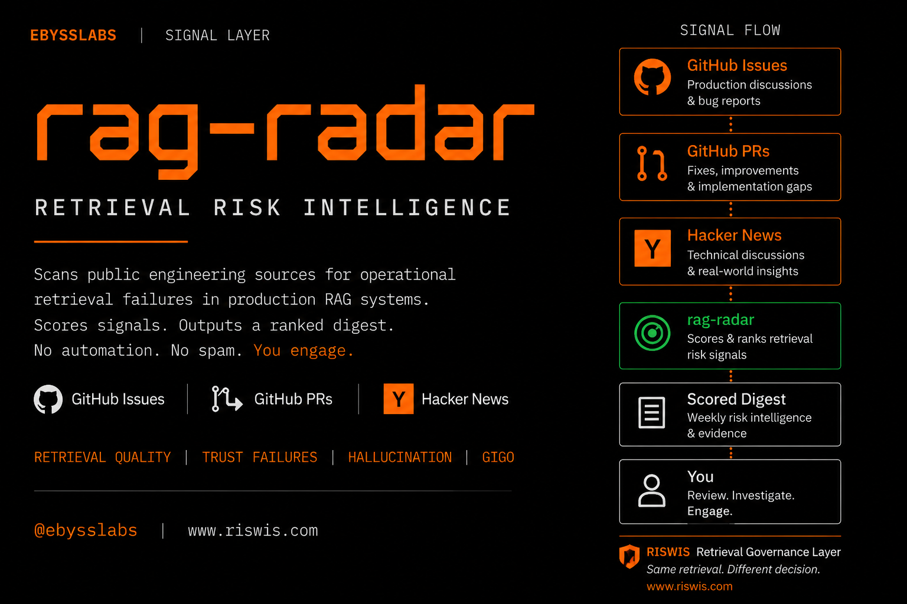

# rag-radar — Production Retrieval Risk Intelligence



Monitoring where retrieval systems fail in production — before those failures become generation risks.

Operational intelligence layer for identifying retrieval reliability failures, governance gaps, and trust instability across deployed RAG systems.

**No automation. No spam. No noise.**

---

## Overview

rag-radar continuously monitors public engineering ecosystems for operational retrieval failures inside production and production-adjacent RAG systems.

The system identifies recurring retrieval reliability failures before they become downstream generation risks.

Current monitored ecosystems include:

* GitHub Issues
* GitHub Pull Requests
* Hacker News
* Public RAG engineering discussions

The system detects:

* Retrieval trust conflicts
* Citation verification failures
* Stale retrieval behavior
* Reranker instability
* Chunk-size instability
* Retrieval audit visibility gaps
* Governance exposure patterns

Outputs include:

* Weekly retrieval risk intelligence reports
* Governance exposure mapping
* Operational retrieval telemetry
* Production reliability trend analysis
* Retrieval failure evidence summaries

Built with Python for lightweight operational telemetry and governance intelligence workflows.

---

## What this is

A retrieval risk intelligence system focused on operational retrieval failures, governance exposure, and trust instability inside modern RAG pipelines.

rag-radar analyzes where retrieval systems fail operationally — not just where generation outputs fail visibly.

---

## What this is not

This repository does not:

* Auto-reply or DM users
* Generate outreach automatically
* Store or publish collected leads publicly
* Operate as a spam or growth bot
* Automate engagement workflows
* Replace retrieval infrastructure
* Replace vector databases or rerankers

Human-in-the-loop by design.

---

## Example Retrieval Risk Signals

```text
RAG Radar — Weekly Retrieval Risk Signals

Captured:
- 25 operational retrieval signals
- GitHub Issues
- GitHub PR discussions
- Retrieval engineering telemetry

Top recurring failure patterns:
1. Chunk-size instability
2. Citation verification failures
3. Reranker inconsistency
4. Retrieval trust conflicts
5. Stale document retrieval

Most common production pattern:
"The right answer exists but retrieval misses it"
```

---

## Retrieval Reliability Index (RRI)

RRI is an internal telemetry metric estimating current retrieval ecosystem stability based on detected operational failures and governance-related exposure.

Factors include:

* Retrieval trust conflicts
* Citation verification failures
* Stale retrieval behavior
* Reranker instability
* Chunk-size instability
* Governance exposure correlation

The metric is designed to track operational retrieval degradation patterns over time across public engineering ecosystems.

---

## Governance Mapping

rag-radar identifies recurring operational retrieval failures across the ecosystem.

RISWIS maps those recurring operational failures to enforceable retrieval governance controls before generation.

| rag-radar Signal               | RISWIS Governance Control          |
| ------------------------------ | ---------------------------------- |
| Citation verification failures | Source trust verification          |
| Retrieval trust conflicts      | Policy-aware retrieval ranking     |
| Chunk-size instability         | Chunk boundary governance          |
| Stale document retrieval       | Freshness-aware retrieval controls |
| Reranker inconsistency         | Retrieval audit visibility         |

Together they form:

```text
Retrieval Risk Intelligence
            ↓
Retrieval Governance
            ↓
LLM Generation
```

---

## Architecture Flow

```text
Engineering Ecosystems
        ↓
rag-radar
        ↓
Retrieval Risk Signals
        ↓
Governance Mapping
        ↓
Manual Investigation / Engagement
```

---

## Controls

* Run collector → scan engineering ecosystems
* Generate digest → identify high-signal operational failures
* Review governance mapping → identify recurring retrieval weaknesses
* Investigate manually → human-in-the-loop by design

---

## Files

* `main.py` — collection pipeline and digest generation
* `collectors.py` — GitHub and Hacker News ingestion
* `keywords.py` — search terms and ecosystem configuration
* `scoring.py` — operational signal scoring
* `theme_detector.py` — retrieval failure theme detection
* `stats.py` — telemetry aggregation and metrics
* `visual_summary.py` — weekly telemetry visualization
* `evidence_summary.py` — operational evidence reporting

---

## Run

```bash
pip install -r requirements.txt
python main.py
```

---

## Outputs

```text
outputs/
  leads_YYYY-MM-DD.json
  digest_YYYY-MM-DD.md
  weekly_summary_YYYY-MM-DD.png
  evidence_summary_YYYY-MM-DD.png
```

---

## Why This Exists

Modern AI systems frequently fail before generation due to:

* weak retrieval trust
* stale retrieval state
* reranker instability
* chunking degradation
* missing governance visibility
* retrieval audit failures

Most AI reliability discussions focus on generation outputs.

rag-radar focuses on the operational retrieval layer underneath them.

The goal is measurable retrieval reliability intelligence — not social automation.

---

## Related

> Same retrieval. Different decision.

RISWIS — Retrieval Governance Layer

https://riswis.com

---

## License

Licensed under the Ebysslabs Ethical Use License v1.1

© 2026 Ronald Reed (Ebysslabs)
